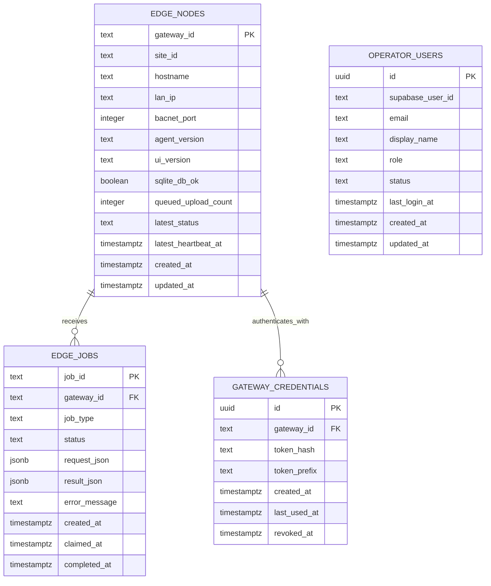
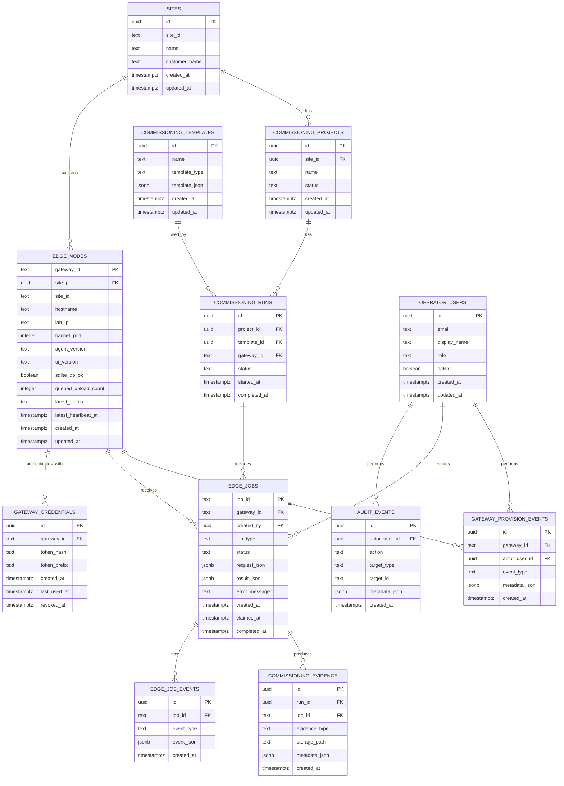

# Entity Relationship Document: IOT Cloud Commissioning

## 1. Purpose

This document describes the logical data model for IOT Cloud Commissioning.

The database is the cloud system of record. Edge gateways keep only local operational state and must not connect directly to Supabase/Postgres.

## 2. Database Boundary

### Cloud Database

The cloud database stores:

- gateway identity
- gateway credentials metadata
- heartbeat-derived gateway status
- cloud-to-edge jobs
- job results
- operator users
- future audit trails, commissioning records, templates, and reports

### Edge Gateway Local State

The edge gateway stores local SQLite state for:

- local job history
- local retry/outbox behavior where needed
- temporary runtime state

The edge gateway must never store:

- Supabase service-role keys
- Postgres credentials
- cloud/server pepper
- `IOT_ADMIN_API_TOKEN`

## 3. Current Core Entities

Current known cloud tables/entities:

- `edge_nodes`
- `gateway_credentials`
- `edge_jobs`
- `operator_users`

The schema below separates current core entities from recommended target entities.

## 4. Current Core ERD



## 5. Entity Details

### 5.1 `edge_nodes`

Represents one provisioned gateway identity.

Recommended fields:

| Field | Type | Required | Notes |
|---|---:|---:|---|
| `gateway_id` | text | Yes | Primary stable gateway identifier, e.g. `GW777` |
| `site_id` | text | Yes | Site or customer location identifier |
| `hostname` | text | Yes | Gateway hostname |
| `lan_ip` | text | No | Gateway LAN IP if reported |
| `bacnet_port` | integer | Yes | Commissioning runtime should be `47814` |
| `agent_version` | text | Yes | Edge agent version |
| `ui_version` | text | Yes | UI version when present |
| `sqlite_db_ok` | boolean | Yes | Edge local DB health |
| `queued_upload_count` | integer | Yes | Pending local uploads |
| `latest_status` | text | Yes | Latest derived gateway status |
| `latest_heartbeat_at` | timestamptz | No | Last heartbeat timestamp |
| `created_at` | timestamptz | Yes | Creation timestamp |
| `updated_at` | timestamptz | Yes | Update timestamp |

Indexes:

- primary key on `gateway_id`
- index on `site_id`
- index on `latest_heartbeat_at`
- index on `latest_status`

### 5.2 `gateway_credentials`

Stores hashed gateway API credentials.

Recommended fields:

| Field | Type | Required | Notes |
|---|---:|---:|---|
| `id` | uuid | Yes | Primary key |
| `gateway_id` | text | Yes | FK to `edge_nodes.gateway_id` |
| `token_hash` | text | Yes | Hashed gateway token, never raw token |
| `token_prefix` | text | Yes | Safe identifier for operator display |
| `created_at` | timestamptz | Yes | Credential creation timestamp |
| `last_used_at` | timestamptz | No | Last successful gateway auth |
| `revoked_at` | timestamptz | No | Null means active |

Indexes:

- index on `gateway_id`
- unique or filtered index for active credential policy
- index on `token_prefix`

Security requirements:

- Raw gateway token is shown only once at provisioning time.
- Raw gateway token is never stored.
- Token hash comparison must be constant-time where practical.
- Gateway token never grants admin/operator privileges.

### 5.3 `edge_jobs`

Stores cloud-to-edge jobs and results.

Recommended fields:

| Field | Type | Required | Notes |
|---|---:|---:|---|
| `job_id` | text | Yes | Primary stable job ID |
| `gateway_id` | text | Yes | FK to `edge_nodes.gateway_id` |
| `job_type` | text | Yes | Example: `bacnet_runtime_check` |
| `status` | text | Yes | `queued`, `claimed`, `completed`, `failed`, `deferred` |
| `request_json` | jsonb | Yes | Operator-created job request |
| `result_json` | jsonb | No | Gateway-produced job result |
| `error_message` | text | No | Failure/deferred reason |
| `created_at` | timestamptz | Yes | Job creation timestamp |
| `claimed_at` | timestamptz | No | Gateway claim timestamp |
| `completed_at` | timestamptz | No | Completion/failure timestamp |

Indexes:

- primary key on `job_id`
- index on `gateway_id`
- index on `(gateway_id, status, created_at)`
- index on `created_at`
- index on `job_type`

Status values:

| Status | Meaning |
|---|---|
| `queued` | Created and waiting for gateway claim |
| `claimed` | Gateway has claimed it |
| `completed` | Gateway completed successfully |
| `failed` | Gateway attempted and failed |
| `deferred` | Gateway could not safely run it now |

### 5.4 `operator_users`

Stores local app authorization for Supabase Auth users.

Recommended fields:

| Field | Type | Required | Notes |
|---|---:|---:|---|
| `id` | uuid | Yes | Internal row ID |
| `supabase_user_id` | text | No | Supabase Auth user ID |
| `email` | text | Yes | Username and unique lookup key |
| `display_name` | text | No | Admin-facing display name |
| `role` | text | Yes | `admin`, `operator`, `viewer`, or `pending` |
| `status` | text | Yes | `active`, `pending`, or `disabled` |
| `last_login_at` | timestamptz | No | Last accepted user JWT |
| `created_at` | timestamptz | Yes | Record creation timestamp |
| `updated_at` | timestamptz | Yes | Last role/status update |

Notes:

- Supabase Auth owns signup, passwords, and email confirmation.
- FastAPI owns app authorization.
- New users register as `pending`.
- Email confirmation does not grant app privileges until an admin assigns an active role.

## 6. Recommended Target ERD



## 7. Recommended Future Entities

### 7.1 `sites`

Groups gateways and commissioning projects by site.

### 7.2 `operator_users`

Represents authenticated users.

Current FastAPI code ties this table to Supabase Auth JWTs. Future RLS policies may expand this into broader profile, organization, and site permission records.

### 7.3 `audit_events`

Records sensitive operator actions:

- provisioning gateway
- creating job
- rotating token
- revoking token
- downloading report
- changing site assignment
- retrying failed job

### 7.4 `edge_job_events`

Provides job lifecycle history beyond the current single-row job status.

Example event types:

- `created`
- `claimed`
- `progress`
- `completed`
- `failed`
- `deferred`

### 7.5 `commissioning_projects`

Represents a commissioning effort for a site.

### 7.6 `commissioning_templates`

Stores reusable point/job templates.

### 7.7 `commissioning_runs`

Represents one execution of a commissioning workflow.

### 7.8 `commissioning_evidence`

Stores generated reports, exports, screenshots, logs, or structured evidence.

Storage may be Supabase Storage or another controlled storage provider.

## 8. Data Rules

### 8.1 Gateway Identity

- `gateway_id` is text, not UUID.
- `gateway_id` must be stable after provisioning.
- Clone image state must not contain a real assigned gateway ID.
- Clone image should use `UNPROVISIONED` only until field provisioning.

### 8.2 BACnet Port

- Cloud commissioning BACnet runtime uses UDP `47814`.
- Legacy UDP `47808` must not be touched by cloud commissioning jobs.
- Job requests should explicitly or implicitly use `47814`.

### 8.3 Secrets

Never store these in source control:

- admin/operator token
- gateway raw token
- Postgres password
- Supabase service-role key
- server pepper
- Render secrets

Never place these on an edge gateway:

- `IOT_ADMIN_API_TOKEN`
- Supabase service-role key
- Postgres credentials
- server pepper

### 8.4 Job Request/Result

- Job creation input field is `request`.
- Database storage field is `request_json`.
- Gateway claim response may expose request as `request`.
- Gateway result is stored as `result_json`.
- Error details must not leak secrets.

## 9. Suggested Constraints

### `edge_jobs.status`

Allowed values:

```text
queued
claimed
completed
failed
deferred
```

### `edge_nodes.bacnet_port`

Preferred default:

```text
47814
```

### `gateway_credentials.revoked_at`

- `NULL` means credential is active.
- Non-null means credential is revoked.

## 10. Migration Guidance

Future migrations should:

1. Preserve current deployed data.
2. Avoid destructive changes without explicit backup and confirmation.
3. Add indexes concurrently where practical.
4. Use nullable fields first for backfills.
5. Add constraints after data is clean.
6. Keep gateway ID as text.
7. Never require edge gateways to connect directly to the database.

## 11. Query Patterns

### 11.1 List Gateways

Primary sort:

```text
latest_heartbeat_at DESC NULLS LAST
```

Filter examples:

- site ID
- latest status
- stale heartbeat
- BACnet port
- agent version

### 11.2 Claim Next Job

Recommended selection:

```text
gateway_id = requested gateway
status = queued
order by created_at asc
limit 1
```

Claim must be atomic to avoid duplicate claim.

### 11.3 List Jobs

Common filters:

- gateway ID
- status
- job type
- created date range
- completed date range

## 12. Open Questions

1. Should `sites` become a first-class table before the first operator UI?
2. Should site-specific permissions be added before the first customer-facing portal?
3. Should job events be added before UI progress indicators?
4. Should commissioning evidence store raw job JSON only, generated files only, or both?
5. Should gateway token rotation be its own milestone before full lifecycle UI?
