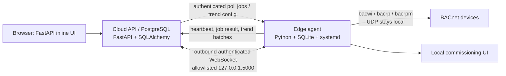

# Foundation and AI Readiness Assessment

**Assessment date:** 2026-07-11
**Method:** source-only review of the cloud API/UI, edge agent, SQLAlchemy and Supabase migrations, deployment scripts, tests, and current documentation. No infrastructure was installed and no runtime configuration was changed.

## Executive assessment

This is a credible **cloud-to-edge commissioning and lightweight trend system**, not yet an end-to-end building operations platform. The core boundary is sound: BACnet stays on the gateway; the cloud requests work through authenticated jobs; the gateway writes to cloud storage over HTTPS; and the local gateway UI can be reached through an outbound, allowlisted WebSocket tunnel. The current trend feature is real: it polls configured BACnet present values, batches reads by device, persists samples locally until upload, stores them in PostgreSQL, and renders responsive browser SVG charts.

The next sensible milestone is **trend hardening and operational data quality**, not Grafana, Timescale, an equipment graph, MCP, or AI. It should make samples typed and quality-aware, establish deduplication/retention/indexes and bounded retry behavior, and make scheduler load explicit. That creates a trustworthy data foundation for all later work.

The most important architectural risk is **schema and documentation drift**. The running API uses SQLAlchemy models and Alembic migrations, while `supabase/migrations/` describes a partially overlapping schema lineage, including different future trend tables. Some product documents still say trends/UI are future work although code now implements them. Before broadening the platform, select and govern one authoritative application schema/migration path.

## Scope and evidence rules

The implementation is treated as authoritative. The following documents are useful intent/history but are not fully current against the source:

- `README.md` describes several now-superseded scope boundaries.
- `docs/architecture.md`, `docs/api-contract.md`, and `docs/ERD.md` include valid concepts but also future-state entities and older version assumptions.
- `supabase/migrations/0004_future_features.sql` defines placeholder `point_samples` and `bacnet_devices`, whereas the running cloud code uses `point_trend_samples`, `saved_bacnet_devices`, and `saved_bacnet_points`.

Evidence below names source paths and principal types/routes; it does not claim that a component is deployed simply because it exists in the repository.

## Current architecture

### Principal implementation surfaces

| Surface | Evidence | Current role |
|---|---|---|
| Cloud API and browser UI | `cloud-api/app/main.py`, `ui.py`, `auth.py`, `tunnel.py` | FastAPI routes, auth, HTML/CSS/JS, job persistence, trend ingestion/query, tunnel relay |
| Cloud database | `cloud-api/app/models.py`, `cloud-api/alembic/versions/0001`–`0011` | PostgreSQL-oriented SQLAlchemy schema and Alembic history |
| Edge runtime | `edge-agent/iot_cx_agent/main.py`, `config.py`, `db.py`, `jobs.py`, `status.py` | systemd process, polling loop, SQLite queue/state, resource heartbeat |
| BACnet adapter | `edge-agent/iot_cx_agent/bacnet.py` | CLI-wrapper discovery, object-list load, single/bulk present-value reads, per-port lock |
| Trend collector | `edge-agent/iot_cx_agent/trends.py` | due-point polling, grouped RPM reads, SQLite store-and-forward, cloud upload |
| Secure reachability | `edge-agent/iot_cx_agent/tunnel.py`, `cloud-api/app/tunnel.py` | outbound WebSocket and local-UI proxy |
| Deployment/update | `deploy/iot-cx-agent.service`, `scripts/install-edge-agent.sh`, `scripts/update-edge-agent.sh`, `scripts/provision-cloned-gateway.*` | systemd installation/provisioning and SSH update workflows |
| Alternate schema lineage | `supabase/migrations/0001`–`0010` | Supabase-oriented SQL definitions; not demonstrated as the API migration source |
| Test evidence | `cloud-api/tests`, `edge-agent/tests` | 234 tests collected in this checkout; unit/integration-style API, BACnet adapter, queue, tunnel, and UI-string coverage |

## Capability status by architecture layer

| # | Layer | Status | Evidence and assessment |
|---:|---|---|---|
| 1 | BACnet device communications | **Implemented but incomplete** | `bacnet.py` wraps `bacwi`, `bacrp`, and `bacrpm`; supports discovery, object-list loading, object-name enrichment, and present-value single/bulk reads. No write handler, COV subscription, alarm/event subscription, BACnet trend-log record read, or formal protocol library. |
| 2 | Edge runtime | **Operational** | `main.py` runs heartbeat, trend sampling/upload, then one job per loop; SQLite persists local jobs, heartbeat attempts, and trend upload queue. `deploy/iot-cx-agent.service` restarts it. It is a single-process sequential loop, not a supervised multi-worker runtime. |
| 3 | Secure connectivity | **Implemented but incomplete** | Gateway bearer credentials are HMAC-verified in `auth.py`; HTTPS API polling and authenticated outbound WebSocket tunnel exist. The tunnel only targets `127.0.0.1:5000` and strips cloud authorization. It lacks explicit device certificate lifecycle, centralized secret rotation workflow, tunnel persistence/HA, and formal audit trail. |
| 4 | Cloud API and jobs | **Operational** | `EdgeJob`, queue/claim/result routes, gateway update requests, health, site, tree, trends, and tunnel routes live in `main.py`. Jobs are polled by the edge; no Redis/Celery/RQ broker. Claiming is sufficient for one agent per gateway but needs concurrency/idempotency review before scale. |
| 5 | Site/gateway configuration | **Implemented but incomplete** | `Site`, `EdgeNode`, direct-connect fields, weather/cache, provisioning, gateway update queue, and UI exist. Site ownership is optional and there is no formal building/floor/area hierarchy or declarative configuration revisions. |
| 6 | BACnet inventory | **Implemented but incomplete** | `GatewayGroup`, `SavedBacnetDevice`, and `SavedBacnetPoint`; tree import/discovery/save/load/read routes. Inventory is operator-approved/saved and gateway-scoped, not continuously reconciled or normalized into networks, models, tags, metadata, or lifecycle states. |
| 7 | Equipment and relationships | **Foundation exists** | Groups/devices/points provide a useful seed. There are no equipment entities, roles, relationship edges, containment hierarchy, semantic tags, or point-to-equipment mappings. |
| 8 | Trend ingestion | **Operational, limited** | `trends.py` fetches enabled configs, checks due time, groups points by BACnet device, uses `run_bacnet_read_bulk`, queues samples in SQLite, and posts up to 100 pending samples. It is polling only. |
| 9 | Time-series storage | **Implemented but incomplete** | `PointTrendSample` is persisted in PostgreSQL with point/time uniqueness and index columns. Values are strings; quality/source/error/ingestion metadata, retention, partitions/rollups, and query cost controls are absent. |
| 10 | Trend visualization | **Operational, limited** | `ui.py` provides responsive custom SVG line charts, hover readout, per-chart theme/size/range controls, and stacked selected point charts. It is not a reusable chart package, saved dashboard/view system, synchronized comparison viewer, or aggregate analytics layer. |
| 11 | Alarms and events | **Not implemented** | The dashboard has a visual “Event Stream” region, but no alarm/event data model, BACnet event collection, rule evaluator, acknowledgment, notification, escalation, or history. |
| 12 | Sequence knowledge | **Not implemented** | No sequence/SOP/library/version/evidence model or runtime validation engine was found. Existing commissioning-template import is point metadata import, not sequence knowledge. |
| 13 | Engineering analysis | **Not implemented** | Health display, point reads, weather cache, and charts are useful observations. No rules, diagnostics, baselining, fault findings, recommendations, or commissioning test results exist. |
| 14 | MCP | **Not implemented** | No MCP SDK, server, tool registry, prompt resources, or policy layer in dependencies/source. |
| 15 | AI | **Not yet appropriate** | No model/API integration or curated evidence model exists. AI can be valuable after trustworthy inventory, typed trend samples, equipment relationships, and bounded tool permissions exist. |

## Data-model assessment

### Present and usable now

| Domain | Current model(s) | Assessment |
|---|---|---|
| Organizations | `Organization` | Exists with `Site.organization_id`, but the foreign key is nullable and current application authorization is role-based, not organization/site-scoped. |
| Sites | `Site`, `SiteWeather` | Good operational site metadata: addresses, coordinates, business hours, direct-connect metadata, weather cache. |
| Gateways | `EdgeNode`, `EdgeHeartbeat`, `GatewayCredential`, `GatewayUpdateRequest` | Strongest domain area: identity, versions, heartbeat history, resource signals, token records, update requests. |
| Edge work | `EdgeJob` | Request/result JSON plus status/timestamps. Suitable for commissioning commands, but without job event history, lease/retry policy, or command/audit linkage. |
| BACnet inventory | `GatewayGroup`, `SavedBacnetDevice`, `SavedBacnetPoint` | Stable saved identity by gateway/device/object/property; enough for UI selection and polling. |
| Trends | `PointTrendConfig`, `PointTrendSample` | One config per saved point and unique point/timestamp samples. |
| Operators | `OperatorUser` | Supabase JWT verification plus an application role/status record. |

### Missing or only represented as future documentation

| Requested concept | Assessment | Needed direction |
|---|---|---|
| Buildings, floors, areas | Missing | Add a containment hierarchy only when one site needs multiple facilities/areas in workflows. Keep `Site` as the customer/location boundary. |
| BACnet networks and router paths | Missing | Separate logical BACnet network/router/port configuration from gateway identity; today an edge node has one resolved commissioning port/profile. |
| Equipment, roles, relationships | Missing | Create equipment instances, equipment types, point roles, and typed relationship edges. Do not force hierarchy into `GatewayGroup`. |
| Manufacturers and models | Missing | Normalize only after inventory collection captures reliable vendor/model identifiers; current `vendor_name` is free text. |
| Units, tags, semantic metadata | Partial | `SavedBacnetPoint.units` is a string; no canonical unit, tag, enum state, description, quality, or metadata versioning. |
| Commands and overrides | Missing | Current reads do not confer a safe write model. Add explicit command/override, priority, expiration, approval, and audit records before BACnet write support. |
| Saved views/dashboards | Missing | Trend controls are browser-local state (`ui.py`); no persisted user/site view. |
| Alarms/events | Missing | Must be separate from trend samples and include state, severity, source, acknowledgment, and notification records. |
| Sequences | Missing | Versioned sequence definitions, applicability, evidence, and test results are absent. |
| Commissioning projects/runs/findings | Not implemented in application schema | `docs/ERD.md` sketches these, but no corresponding SQLAlchemy model/Alembic migration was found. |

### Schema governance finding

There are two overlapping schema narratives:

1. **Application lineage:** `cloud-api/app/models.py` + `cloud-api/alembic/versions/0001`–`0011`. The Dockerfile runs `alembic upgrade head`, and current API code uses these table names.
2. **Supabase lineage:** `supabase/migrations/0001`–`0010`. It contains core/security proposals plus placeholders such as `public.point_samples` and `public.bacnet_devices`.

Do not extend both independently. Decide whether Alembic remains the sole application-schema authority against Supabase/Postgres, or deliberately reconcile and retire/align one migration lineage. This is an immediate stabilization item because divergent tables make data ownership, migration deployment, backups, and AI/MCP grounding unreliable.

## BACnet inventory and communications assessment

### What is implemented

- Discovery uses `bacwi`, parsed by `parse_bacwi_output`, with device ID, MAC, network, SADR, and APDU in the returned job result.
- Point loading reads the device `object-list` through `bacrpm` indexed blocks when possible, otherwise `bacrp` indexed reads. Supported load types include analog/binary/multistate objects, schedules, commands, calendars, files, loops, notification classes, programs, and `trend-log` objects.
- Name enrichment uses RPM in batches of 40 and falls back to individual reads.
- Operational reads are restricted to a smaller present-value set: analog, binary, multistate, and schedule object types. `run_bacnet_read_bulk` uses RPM then falls back to individual `bacrp` reads.
- `BacnetRuntimeLock` coordinates the cloud agent’s local BACnet CLI use per resolved UDP port and yields/defer jobs if busy. Default commissioning profile is UDP 47814; BAC-RTR profile is 47809; `BACNET_IP_PORT` overrides explicitly. The legacy runtime on 47808 is deliberately separated by policy/docs.

### Limitations that matter before scaling

- Device discovery is a command result, not a continuously maintained inventory scan with first/last seen/reconciliation and approval state.
- Object discovery does not persist full protocol metadata: object description, units property verified from device, state text, reliability, status flags, COV increment, writable priority capabilities, device model/firmware, or routing path.
- A `trend-log` object can be discovered as an object type, but **Trend Log records are not read**. The current product trend is cloud-configured polling of present value.
- No BACnet writes, priority array handling, relinquish/default, command verification, rollback, or override expiration exists. These should remain out of scope until an audited command subsystem is designed.
- A single loop performs heartbeat, trend work, and one job sequentially. Large collections, slow CLI calls, or many configured trends can delay each other; the current per-port lock protects safety but not scheduling fairness.

## Trend readiness assessment

### Current end-to-end path

1. An operator enables/edits a point trend through `PUT /api/ui/points/{point_id}/trend` in `cloud-api/app/main.py`.
2. The edge loop calls `sample_configured_trends` once per heartbeat loop (`main.py`), reads enabled configurations from `GET /api/edge/{gateway_id}/trend-configs`, and tests last local sample time against `interval_sec`.
3. Due points are grouped by BACnet device and read using `run_bacnet_read_bulk` (`bacrpm` preferred).
4. Successful values are queued in edge SQLite `sync_queue` as `trend_sample`; a last-sample timestamp is kept in `agent_state`.
5. `upload_pending_trend_samples` posts batches of at most 100 to `POST /api/edge/{gateway_id}/trend-samples`; successful rows become `uploaded`.
6. The API persists `PointTrendSample` with unique `(point_id, sampled_at)`.
7. The browser requests `GET /api/ui/points/{point_id}/trend?limit=&since=` and `ui.py` draws a custom SVG chart.

### Explicit distinctions

| Mechanism | Current status |
|---|---|
| Current present-value read | Implemented through cloud job requests and edge BACnet single/bulk reads; supports UI refresh. |
| Cloud trend polling | Implemented; scheduled only by edge loop/last sample logic and configured intervals. |
| BACnet Trend Log record ingestion | Not implemented. `trend-log` is loadable inventory only. |
| BACnet COV subscription | Not implemented. |
| Local store-and-forward | Implemented for trend samples in SQLite `sync_queue`; successful upload status is retained. |
| Numeric/time-series semantics | Incomplete: sample value is `String(255)` and no quality/status/source/error metadata is stored. |
| Retention/downsampling/rollups | Not implemented. |
| Chart rendering | Implemented with inlined browser JavaScript/SVG; responsive width, hover, range/size/theme controls, stacked selected-point cards. |
| Saved views/comparisons/overlays | Not implemented. |

### Trend hardening requirements

- Record `value_numeric` (where applicable) separately from a raw/text representation, BACnet timestamp vs edge capture timestamp vs cloud receipt timestamp, source, units snapshot, quality/status flags, and error/retry reason.
- Use a batch identity/idempotency key or queue-row identity in addition to `(point_id, sampled_at)`, and define a collision policy for same-timestamp changes.
- Bound the edge queue by age/size, record upload attempts/errors, and expose backlog age, not only pending count.
- Define interval limits and an explicit scheduler budget per gateway (maximum reads/minute, batches/device, jitter, priority). The current sequential heartbeat-loop design should not silently become a high-rate collector.
- Add indexes/query plans and a retention policy before historic sample volume grows. Start with plain PostgreSQL partitioning/rollups only when measured volume requires them.

## Installation and infrastructure assessment

| Component | Recommendation | Rationale |
|---|---|---|
| PostgreSQL | **Needed now; already used** | SQLAlchemy models/Alembic and Docker Compose target PostgreSQL. Keep this primary operational datastore. |
| Supabase Auth/JWT | **Needed now only if portal auth remains chosen** | API already validates Supabase JWT/JWKS, while app roles live in `operator_users`. Reconcile schema ownership separately. |
| Edge SQLite | **Needed now; already used** | Appropriate durable local queue/state/journal for a gateway. Add queue health/retention controls rather than replacing it. |
| Redis | **Next milestone only if proven need** | Not required for current poll-job design. Consider for distributed rate limits, cache, or background queue only after real concurrency/latency measurements. |
| Dedicated workers | **Next milestone** | Current FastAPI process and edge loop handle work. Introduce a worker only for long cloud jobs, report generation, retention/rollups, notifications, or sustained ingestion pressure. |
| WebSockets/SSE to browser | **Optional later** | WebSocket is already justified for edge tunnel. Browser dashboard can poll now; add SSE/WebSocket only when live status/alarm UX has a measured need. |
| Grafana | **Optional later** | Useful for internal platform/edge observability and ad-hoc engineering dashboards, not a replacement for the product’s contextual commissioning UI. Do not install now. |
| TimescaleDB | **Later, conditional** | PostgreSQL table/index/retention design is simpler for present scale. Revisit only with measured sample cardinality, history, query latency, and rollup needs. Do not install now. |
| Apache Arrow / columnar lake | **Not yet appropriate** | No bulk analytics/export workload justifies it. |
| Object storage | **Next milestone when evidence/files exist** | Needed for commissioning reports, captures, photos, and large exports; no current report-file implementation uses it. |
| Message broker | **Not recommended now** | Edge polling plus SQLite store-and-forward is simpler and works through restrictive networks. Reconsider for high-volume event ingestion or command fan-out. |
| MCP SDK/server | **Later** | First establish immutable/audited domain APIs and site-scoped authorization. |
| Chart library | **Optional later** | Custom SVG is adequate for current simple charts. Adopt a library only when needed for interaction, canvas performance, overlays, or accessibility—not merely for abstraction. |
| Metrics/logging/alerting platform | **Next milestone** | Resource heartbeat is a good start; operational monitoring needs structured logs, uptime/queue-age alerts, and central dashboards before adding product AI. |

### Grafana and Timescale recommendation

Do **not** add either today. Use PostgreSQL plus the current UI while the product establishes sample semantics, retention expectations, and real load numbers. Add Grafana first only for engineering/operations visibility if the existing health card and logs are insufficient. Evaluate Timescale only after a measured threshold is crossed (for example, sustained multi-site high-frequency data, long history, costly range queries, and a defined rollup/retention plan). Installing either now would conceal unresolved data-model questions rather than solve them.

## MCP readiness

MCP is feasible later because the cloud API already provides a protected central control plane and stable gateway/point identifiers. It is **not ready to expose directly** until the authorization, schema, and audit model are strengthened.

Potential future read-first tools:

- `list_sites`, `get_site_context`, `list_gateways`, `get_gateway_health`
- `get_gateway_inventory`, `find_points`, `get_point_current_value`, `get_point_trend`
- `get_job_status`, `get_commissioning_evidence` (after evidence exists)
- `search_equipment`, `get_equipment_context` (after equipment model exists)
- `list_active_alarms`, `get_alarm_history` (after alarms exist)

Potential controlled actions, later and never implicit:

- queue discovery/read jobs;
- enable or edit a trend only within approved interval budgets;
- create a commissioning test/run;
- propose, but not execute, an override/command.

Required foundations: organization/site scope on every resource, role/action authorization, audit events with actor/request/result, idempotency, rate limits, explicit confirmation for write-like actions, and clean API contracts independent of the inline UI.

## AI readiness

AI should begin as a **read-only, evidence-citing assistant** after the immediate trend and model work—not as a controller. Good initial uses are explaining gateway health, summarizing commissioning job results, identifying missing metadata, and generating draft investigation checklists from selected points and trend windows.

Do not ask AI to make operational findings until it can ground answers in:

- a canonical equipment/point relationship model;
- typed data with units, timestamps, quality, and provenance;
- sequence/SOP documents with versions and applicability;
- alarm/finding records and operator feedback;
- site-scoped permissions and audit logs.

AI-driven BACnet writes, overrides, setpoint changes, or autonomous corrective action are explicitly out of scope. Any future action must flow through a separate, auditable command/approval subsystem.

## Roadmap

### Phase 0 — Immediate stabilization

**Objective:** make current cloud/edge behavior governable and observable without changing product scope.

- **Source work:** document authoritative architecture from code; reconcile stale docs; add structured application/edge logging fields; make job claim/retry/deferred behavior explicit; add health/backlog age visibility.
- **Database:** choose one schema/migration authority; record migration provenance; add only operational audit/job-attempt entities if needed.
- **Infrastructure:** PostgreSQL, current edge SQLite, existing systemd. No Redis, Grafana, Timescale, broker, MCP, or AI.
- **Dependencies:** deployment discipline and confirmation of production migration execution.
- **Risks:** parallel Alembic/Supabase history; startup schema self-healing in `main.py` can conceal missed migration deployment.
- **Definition of done:** a new environment can apply one documented migration path; stale docs are labelled or updated; a gateway’s queue age, heartbeat age, agent version, and job outcome are explainable from records.
- **Do not build:** new domain modules or protocol features.

### Phase 1 — Foundation model

**Objective:** establish durable, scoped operational identity before semantic features.

- **Source work:** site-scoped authorization; explicit inventory lifecycle; contract/API separation from UI; data ownership rules.
- **Database:** organization membership enforcement; site/building/area only where needed; gateway-to-network/router configuration; canonical device metadata/version source.
- **Infrastructure:** none beyond PostgreSQL backups and migration process.
- **Dependencies:** Phase 0 schema decision.
- **Risks:** prematurely forcing customer-specific naming/hierarchy into universal tables.
- **Definition of done:** every inventory record is scoped to organization/site/gateway; imports and discovery are idempotent and reconcile first/last-seen state.
- **Do not build:** full equipment ontology or AI.

### Phase 2 — Trend collection hardening

**Objective:** turn the existing polling feature into trustworthy operational telemetry.

- **Source work:** scheduler budget/jitter, per-point error states, bounded queue/retry, typed parser/output, upload idempotency, backpressure/health metrics.
- **Database:** typed numeric/raw value representation, units snapshot, quality/status/source timestamps, retention metadata, appropriate indexes.
- **Infrastructure:** PostgreSQL and SQLite only; worker/partitioning only after load tests show need.
- **Dependencies:** stable point identity/inventory from Phase 1.
- **Risks:** uncontrolled interval selection overwhelming gateway BACnet runtime; string-only values preventing meaningful analytics.
- **Definition of done:** a disconnected gateway retains then safely drains samples; no silent overdue points; sample provenance and quality are visible; load budget is tested on representative gateway hardware.
- **Do not build:** Trend Log/COV, Timescale, Grafana product dashboards, or anomaly AI.

### Phase 3 — Trend viewer and operations UX

**Objective:** make trusted samples useful to engineers without overbuilding a BI platform.

- **Source work:** saved scoped views, comparison/overlay/synchronized cursor where appropriate, units/quality display, empty/error states, export with provenance.
- **Database:** saved views and user/site preferences; optional annotations.
- **Infrastructure:** continue browser SVG or adopt a chart library only after interaction/performance requirements are clear.
- **Dependencies:** Phase 2 data quality and retention behavior.
- **Risks:** chart UI hides bad/missing data or encourages nonsensical cross-unit comparisons.
- **Definition of done:** an operator can reopen a named view and distinguish data gaps, failures, and units; range queries remain responsive under defined load.
- **Do not build:** Grafana as the customer workflow replacement.

### Phase 4 — Equipment model

**Objective:** link points to meaningful systems and roles.

- **Source work:** equipment type/instance/relationship APIs, point-role mapping, human review workflow, import adapters.
- **Database:** equipment, equipment type, containment/relationship edges, point-role/tag tables, normalized manufacturer/model once source quality exists.
- **Infrastructure:** PostgreSQL only.
- **Dependencies:** Phase 1 identity/inventory and Phase 2 units/quality.
- **Risks:** attempting automated semantic inference before naming quality and human review rules exist.
- **Definition of done:** selected equipment has a navigable, versioned set of related points and relationships, with source/confidence/reviewer provenance.
- **Do not build:** graph database unless relational queries prove insufficient.

### Phase 5 — Alarms, sequences, and commissioning evidence

**Objective:** capture explainable operational context.

- **Source work:** read-only event ingestion first, rule/sequence versioning, commissioning run/test/finding workflow, notification policy.
- **Database:** alarm/event state and acknowledgement, sequence/SOP versions, applicability, commissioning projects/runs/evidence/findings.
- **Infrastructure:** object storage for evidence files when real reports/captures are needed; worker for notifications/reports if required.
- **Dependencies:** equipment model and trustworthy telemetry.
- **Risks:** treating raw BACnet values as alarms without device-specific semantics or acknowledgement policy.
- **Definition of done:** a finding can cite source points, samples, sequence version, operator, and evidence; no automated write path is introduced.
- **Do not build:** autonomous remediation.

### Phase 6 — MCP

**Objective:** expose safe, narrow, auditable engineering context and read actions.

- **Source work:** MCP server/tool schemas backed by versioned cloud APIs; policy/audit middleware; read-first resources.
- **Database:** audit events and optional conversation/request linkage; no model-specific data required.
- **Infrastructure:** MCP SDK/server runtime, isolated credentials, observability.
- **Dependencies:** site-scoped authorization and evidence model from earlier phases.
- **Risks:** exposing broad query/write access before tenancy and audit are real.
- **Definition of done:** a read-only tool call is scoped, logged, reproducible, rate-limited, and returns source/provenance.
- **Do not build:** direct BACnet writes or unrestricted SQL tools.

### Phase 7 — AI assistant

**Objective:** provide grounded engineering assistance, not automation theater.

- **Source work:** retrieval over approved sequence/equipment/evidence data; evidence-citing summaries; evaluation corpus; human feedback capture.
- **Database:** findings/recommendations with source references and review status; no opaque AI-owned system of record.
- **Infrastructure:** chosen model provider, evaluation/observability, redaction/policy controls.
- **Dependencies:** MCP read layer, equipment/context model, sequence/evidence data, and explicit safety policy.
- **Risks:** hallucinated operational advice, false causality from sparse trends, leaking cross-site information.
- **Definition of done:** the assistant cites data windows and source records, distinguishes observation from inference, handles uncertainty, and cannot execute control actions.
- **Do not build:** autonomous optimization, overrides, or setpoint control.

## Explicit “do not build yet” list

- Grafana, TimescaleDB, Redis, a message broker, Arrow/lakehouse, or a graph database.
- BACnet writes, priority-array manipulation, overrides, or AI-driven commands.
- BACnet COV or Trend Log collection before current polling has quality/backpressure/retention discipline.
- A full building/equipment ontology before the inventory and workflow require it.
- Alarm notifications before an alarm state/acknowledgement/escalation model exists.
- MCP write tools or AI actions before authorization and audit foundations are complete.
- A separate frontend framework rewrite; the inline UI is currently functional and should not be displaced during data-foundation work.

## Recommended next milestone

**Trend collection hardening on the existing PostgreSQL + SQLite architecture.**

It delivers the highest immediate engineering value, exercises the gateway under controlled load, protects the current UI investment, and supplies the reliable evidence needed for equipment modeling, alarms, MCP, and AI. First write a small design that fixes sample semantics, quality/provenance, interval budget, queue/retry limits, and retention; then implement it behind tests and measured gateway load checks.

## Assumptions and gaps

- This assessment does not inspect a running Render/Supabase/Postgres instance, gateway filesystem, or actual BACnet device behavior.
- Source proves API/agent capability, not that every migration or newer edge version is deployed in the field.
- No production volume, retention target, RPO/RTO, concurrency target, or gateway fleet SLA was supplied; infrastructure recommendations are therefore intentionally conservative.
- The external edge commissioning UI is referenced by the code/docs but is not part of this repository, so its internal BACnet capabilities were not assessed.
- Test collection found 234 tests in this checkout; collection is evidence of coverage intent, not a replacement for deployment and hardware load validation.
