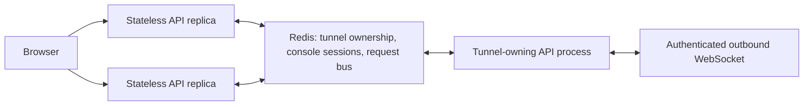

# Production Scale Contract

This document defines the minimum operating architecture for IOT Cloud
Commissioning to serve customers reliably. It is a delivery contract, not a
future-ideas list. A feature is not production-ready until it meets the
applicable controls below.

## Current deployment posture

The current deployment is a **single API instance** connected to PostgreSQL
through Supabase's IPv4 Session Pooler. This is appropriate only while the
application is explicitly operated as a single-instance service.

The application now has a bounded, configurable database pool:

```text
DATABASE_POOL_SIZE=2
DATABASE_MAX_OVERFLOW=0
DATABASE_POOL_TIMEOUT_SEC=30
DATABASE_POOL_RECYCLE_SEC=300
```

The combined maximum across all API and worker processes must remain below the
database pooler's available client budget, leaving capacity for the migration
runner and operational access. `/health/db` reports the process-local pool
implementation and checked-in/checked-out metrics; it must be monitored with
the database provider's pool saturation metrics.

## Non-negotiable deployment rules

1. `cloud-api/alembic/` is the sole owner of FastAPI-owned schema changes.
2. A deployment applies `alembic upgrade head` exactly once in the controlled
   pre-deploy phase. The application container never runs migrations at
   startup.
3. Every API and worker process has an explicit database connection budget.
   Default SQLAlchemy pool settings are prohibited in managed environments.
4. Application startup refuses to serve a database at an unexpected Alembic
   revision.
5. Production health checks cover API reachability, database reachability,
   schema revision, database-pool pressure, queue age, and gateway heartbeat
   age.
6. Production deploys are reversible: a prior image can be restored without
   running downgrade migrations automatically.

## The scale boundary that must be removed before API replicas

`TunnelManager` and `TunnelSessionManager` currently keep live gateway
WebSocket ownership and console sessions in process memory. That makes a
second API instance unsafe: a browser request can reach an instance that does
not own the gateway's WebSocket.

Before running more than one API replica, implement a shared tunnel control
plane:



The owning process remains responsible for its actual WebSocket; Redis stores
ownership/TTL and carries a bounded request/response envelope to that process.
Disconnects, process death, and expired sessions must clean ownership records.
Do not try to share a Python WebSocket object across instances.

## Workload separation

The public API must serve authentication, configuration, UI reads, and short
job-queue writes only. The following work belongs in independently deployed,
observable workers when volume or latency requires it:

- trend retention, rollups, and exports;
- report/file generation;
- notification delivery;
- durable tunnel request relay once replicas are enabled;
- batch reconciliation and operational maintenance.

Gateway BACnet operations remain edge-owned. The cloud stores a durable job
request; the gateway claims it outbound, executes locally, and posts an
idempotent result. No cloud worker opens BACnet traffic to a customer network.

## Capacity and reliability gates

Before declaring a customer tier supported, define and test its gateway count,
points per gateway, refresh rate, trend sample rate, concurrent operators,
retention period, and recovery objective. The test must prove:

1. no database pool saturation at sustained and burst load;
2. bounded API latency and error rate;
3. queue age and job completion within the tier's target;
4. idempotent recovery after an API, worker, database-pooler, or gateway
   disconnect;
5. tunnel routing correctness across API replicas;
6. backup restore and migration rehearsal against a production-sized copy.

## Delivery sequence

### Phase 1 — complete now

- bounded database configuration and pool health: implemented;
- single controlled Alembic pre-deploy path: implemented;
- production health and schema gates: implemented;
- document database budget for the current Supabase Session Pooler: required
  in deployment configuration.

### Phase 2 — required before horizontal API scaling

- Redis-compatible shared tunnel registry, request relay, and console-session
  storage;
- stateless API replicas and a deliberate WebSocket ownership strategy;
- structured JSON logs, request IDs, metrics, alerts, and uptime checks;
- API rate limits and per-site/gateway concurrency limits.

### Phase 3 — required before high-volume operations

- worker service(s) for non-request work;
- durable retry/dead-letter policies and queue-age alerts;
- trend retention/rollups and query-cost controls;
- production load suite and repeatable restore/migration rehearsal;
- disaster recovery, secret rotation, and incident runbooks.

No new feature may bypass these boundaries by adding long-running work to a
web request, unbounded in-memory state, implicit database connections, or a
second migration authority.
